= Rocking AWS Serverless

== This training also includes

- https://quarkus.io/[Quarkus.io]
- https://www.terraform.io/[Terraform]
- https://camel.apache.org/[Apache Camel]
- https://aws.amazon.com/blogs/architecture/deploy-quarkus-based-applications-using-aws-lambda-with-aws-sam/[Deploy Quarkus-based applications using AWS Lambda with AWS SAM]
- https://github.com/graalvm/mandrel/releases[Mandrel Releases GitHub]

== Links

- https://github.com/serverless/serverless/discussions/10061[ARM64 bug fix]
- https://registry.terraform.io/modules/terraform-aws-modules/lambda/aws/latest[Terraform AWS Module]

https://github.com/clouddrove/terraform-aws-api-gateway/tree/master

https://github.com/c0nfleis/terraform-examples
https://dev.to/mxglt/declare-a-simple-rest-api-gateway-terraform-5ci5

https://www.bogotobogo.com/DevOps/AWS/aws-API-Gateway-Lambda-Terraform.php

== Section 01

.Comparison between Models
[%header,cols=3*]
|===
|Datacenter Traditional
|CloudVM EC2 Model
|Serverless (Lambda/Fargate)

|We Must manage everything related to Datacenter, spend money on every new improvement, hard to control the main problem that is wasted resources
|Datacenter costs are too reduced, you need to manage the virtualization to serve the traffic appropriately, in this model there is a possibility of waste resources
|Cost-effective, and no server management is the main concern in this scenario, nothing about infra/hardware/traffic. just concern in your buzz requirements, but there are scenarios where the cost can be increased much more than virtualization,
|===

.Classify Serverless Ecosystem
[%header,cols=3*]
|===
|Compute
|Storage
|Integration, Analytics

|Lambda and Fargate
|S3, EBS, DynamoDb, Aurora RDS
|API Gateway, SQS, Step-functions SNS etc
|===

=== Some Lambda Details

* Can choose from 128mb to 10GB, with CPU and Network allocated proportionally and 15min runtime
* Can be invoked synchronous (e.g; API) or asynchronous (e.g; SQS, S3)
* Inherent integration with other AWS services
* Lambdas definitely aren't the silver bullet for all solutions
* Lambda lets you run code without provisioning or managing servers
* With lambda, you can run the code for virtually any type of application or backend service—all with zero administration
* Upload your code, and _Lambda_ takes care of everything required to run and scale your code with high availability
* You pay only for the compute time you consume

=== Test the 4Rules Yes for all of them

1. No Servers to provision or manager
2. Automatically scales with usage
3. Never pay for idle
4. Availability and fault tolerance built in

.Compile Native Mode Quarkus
[source,bash]
----
#mvn clean -DskipTests verify package -Dnative
# mvn -DskipTests clean package -Dnative -Dquarkus.native.container-build=true

./mvnw package -Pnative -Dquarkus.native.container-build=true -Dquarkus.native.builder-image=quay.io/quarkus/ubi-quarkus-mandrel-builder-image:jdk-21

mvn package -Pnative -Dquarkus.native.container-build=true -Dquarkus.native.builder-image=quay.io/quarkus/ubi-quarkus-mandrel-builder-image:jdk-21
----

.Lambda Session01-v1 Payload
[source,json]
----
{
  "ssn": "088-16-12AB",
  "name": "John Doe"
}
----

=== IAM Structure

.Create Policy Sample
[source,json]
----
{
  "Version": "2012-10-17",
  "Statement": [
    {
      "Effect": "Allow",
      "Action": [
        "s3:Get*",
        "s3:List*"
      ],
      "Resource:": "*"
    }
  ]
}
----

* EC2 needs to access an AWS Service, IAM Role attached to this instance; that means EC2 has a polity to access S3, read/write DynamoDb

== Section 02

* API Gateway can create, configure and host an API, can be used for AuthC and AuthZ, tracing caching and throttling of API requests and staged deployments, canary release

=== AWS API Gateway

[source, bash]
----
curl -v -H "Content-Type: application/json" -X POST https://j3657j7po9.execute-api.sa-east-1.amazonaws.com/dev/hello -d '{
    "ssn": "808-112",
    "name": "Jon Doe"
}'
----

.Advanced API Gateway 4MSA Usage
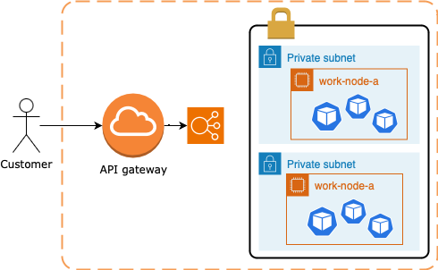

.Open API Def
[source,yaml]
----
openapi: "3.0.1"
info:
  version: 0.0.1
  title: My awesome API
  description: My awesome API
paths:
  /debug:
    get:
      operationId: getDebug
      responses:
        default:
          description: "Default response for GET /debug"
      x-amazon-apigateway-integration:
        $ref: '#/components/x-amazon-apigateway-integrations/debug'

components:
  x-amazon-apigateway-integrations:
    debug:
      type: AWS_PROXY
      httpMethod: GET
      uri: "${example_function_arn}"
      payloadFormatVersion: "2.0"
      connectionType: INTERNET
----

[source,hcl-terraform]
----
module 'my-awesome-api-gateway' {
  name = "${var.api.name}-http"
  description   = "My awesome HTTP API Gateway"
  protocol_type = "HTTP"
  cors_configuration = {
    allow_headers = ["content-type", "x-amz-date", "authorization", "x-api-key", "x-amz-security-token", "x-amz-user-agent"]
    allow_methods = ["*"]
    allow_origins = ["*"]
  }

  default_stage_access_log_destination_arn = aws_cloudwatch_log_group.logs.arn
  default_stage_access_log_format          = "$context.identity.sourceIp - - [$context.requestTime] \"$context.httpMethod $context.routeKey $context.protocol\" $context.status $context.responseLength $context.requestId $context.integrationErrorMessage"

  default_route_settings = {
    detailed_metrics_enabled = true
    throttling_burst_limit   = 100
    throttling_rate_limit    = 100
  }

  integrations = {

  "ANY /" = {
      lambda_arn             = module.lambda_function.lambda_function_arn
      payload_format_version = "2.0"
      timeout_milliseconds   = 12000
    }

  "GET /some-route" = {
      lambda_arn               = module.lambda_function.lambda_function_arn
      payload_format_version   = "2.0"
      authorization_type       = "JWT"
      authorizer_id            = aws_apigatewayv2_authorizer.some_authorizer.id
      throttling_rate_limit    = 80
      throttling_burst_limit   = 40
      detailed_metrics_enabled = true
    }

    # ALB/VPC Link module integration, sample
    "GET /alb-internal-route" = {
      connection_type    = "VPC_LINK"
      vpc_link           = "my-vpc"
      integration_uri    = module.alb.http_tcp_listener_arns[0]
      integration_type   = "HTTP_PROXY"
      integration_method = "ANY"
    }

    body = templatefile("api.yaml", {
      example_function_arn = module.lambda_function.lambda_function_arn
    })

    tags = {
      Name = locals.aws.api-gateway
    }
  }
}
resource "aws_api_gateway_deployment" "my-awsome-api-gateway-deployment" {
  rest_api_id = my-awesome-api-gateway.foo-http.id
  lifecycle {
    create_before_destroy = true
  }
}
resource "aws_apigatewayv2_stage" "my-awsome-api-gateway-stage" {
  deployment_id = my-awesome-api-gateway.foo-http.id
  stage_name   = "example-stage" # or data.resource
}
----

.AWS Gateway Response Header Sample
[source,json]
----
{
  "X-Amzn-Trace-id": "Root=1-5ba446c3-2de08ea5038211;Sampled=0",
  "Content-Type": "application/json"
}
----

=== AWS API Gateway Components

.Gateway Lifecycle
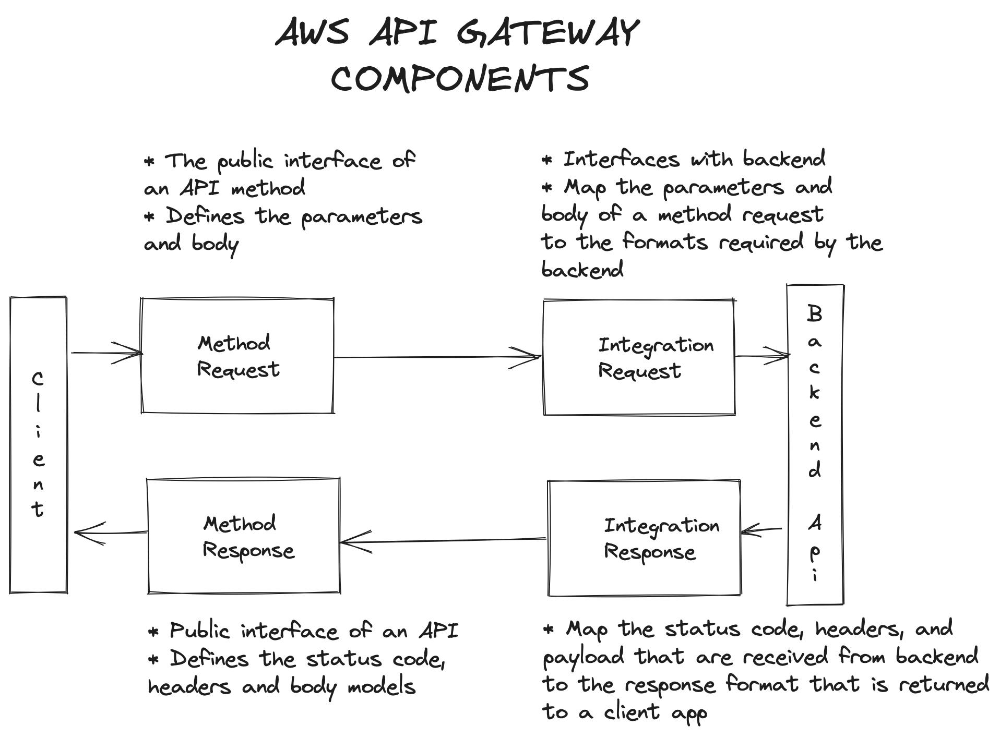

. _Usage Plan_, provides selected API clients with access to one or more deployed apis, with a usage plan we can configure throttling and quota limits
. _API Developer_, AWS account that owns an API Gateway deployment
. _App Developer_, An app creator who may or many not have an AWS account and interacts with API that you, app devs are your customers, API key
. _Resources & Methods_, (GET, POST) each method along with resources, are deployed to stages, with invoke url for each method under each resource in each stage
. Query String with _Mapping Request Template (Apache Velocity)_
. With alias in Lambdas, we can shift the traffic, using a combination of versionTest:${stageVariables.lambdaAlias}

==== Canary Deployment

* Basic idea API Gateway => API Stage => Lambda 1 (Base Version), with the stage's Request Distribution (calculated percentage of requests directed to Canary/Dev)

==== Gateway Endpoint Types

. _Edge Optimized_ designed to help you reduce client latency from anywhere on the Internet

.Gateway Edge Optimized
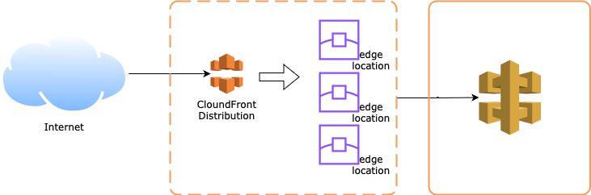

. _Regional_ designed to reduce latency when calls are made from the same region as the api

.Gateway Regional
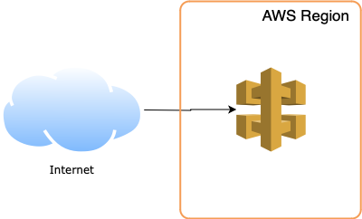

.Gateway Regional and Route 53
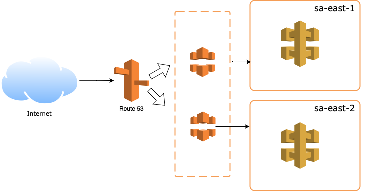

. _Private_ designed to expose APIs only inside your VPC

.Gateway Private
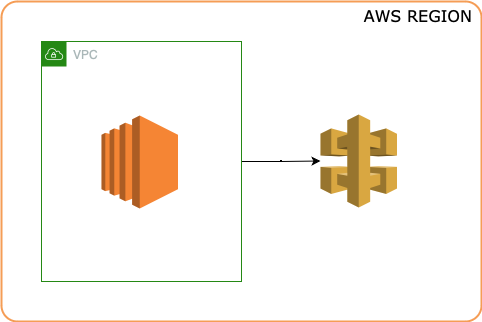

==== POST API

* POST Resource mapped to Lambda

==== Query Param

[source,hcl-terraform]
----
 resource "aws_api_gateway_method" "example_api_method" {
      rest_api_id = "${aws_api_gateway_rest_api.example_api.id}"
      resource_id = "${aws_api_gateway_resource.example_api_resource.id}"
      http_method = "GET"
      authorization = "NONE"
      request_parameters = {
        "integration.request.querystring.account_id"=true
      }
}
----

==== Cross Account

To call a resource from a different account basic we need to copy the ARN,
_arn:aws:lambda:sa-east_1:41133459552890:function:helloWorldFromSecondAccount_ with permissions

.AWS Cloud 9 CLI deploying lambda with version and alias
[source,bash]
----
aws lambda add-permission --function-name \
"arn:aws:lambda:sa-east-1:87221112320:function:versionTest:${stageVariables:lambdaAlias}" \
--source-arn "arn:aws:execute-api:sa-east-1:87221112320:fq331sr24gwy/*/GET/" \
--principal apigateway.amazonaws.com \
--statement-id bc4636a9-09dc5-447d-a612-93c0b73e4276 \
--action lambda:InvokeFunction
----

Or in Terraform
[source, hcl-terraform]
----
resource "aws_lambda_permission" "apigtw_lambda_permissionByInvoke" {
  action        = "lambda:InvokeFunction"
  function_name = "${module.lambda.lambda_function_name}"
  principal     = "apigateway.amazonaws.com"
  statement_id = "AllowAPIGatewayInvoke"
  #
  # The "/*/*" portion grants access from any method on any resource
  # within the API Gateway REST API.
  # In ad different account
  source_arn    = "${aws_api_gateway_rest_api.helloWorld_apiGateway.execution_arn}/*/*"
}
----

==== Lambda Alias and traffic Splitting (Canary Deployment)

We can split the traffic based on alias/version of your lambdas as demonstrated bellow

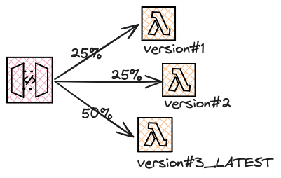

[source,hcl-terraform]
----
resource "aws_lambda_alias" "test_lambda_alias" {
  name             = "my_alias"
  description      = "a sample description"
  function_name    = aws_lambda_function.lambda_function_test.arn
  function_version = "1"

  routing_config {
    additional_version_weights = {
      "2" = 0.5
    }
  }
}
----

==== Integration Types

* Lambda Function
* HTTP
* Mock
* AWS Service
* VPC Link

==== API Caching

[source, hcl-terraform]
----
resource "aws_api_gateway_integration" "MyDemoIntegration" {
  rest_api_id          = aws_api_gateway_rest_api.MyDemoAPI.id
  resource_id          = aws_api_gateway_resource.MyDemoResource.id
  http_method          = aws_api_gateway_method.MyDemoMethod.http_method
  type                 = "MOCK"
  cache_key_parameters = ["method.request.path.param"]
  cache_namespace      = "foobar"
  timeout_milliseconds = 29000

  request_parameters = {
    "integration.request.header.X-Authorization" = "'static'"
  }

  # Transforms the incoming XML request to JSON
  request_templates = {
    "application/xml" = <<EOF
{
   "body" : $input.json('$')
}
EOF
  }
}
----

==== Swagger and OpenAPI 3

* API as Code
* Human and machine-readable to create APIs
* Share APIs internally and externally
* Generates API documentation
* Supports Yaml and Json
* Now called "Open API Initiative"
* You can generate Swagger files for all your APIs in API Gateway, even if you created them console
* Recreate your APIs
* Enables you to use any API Management tool (NOT Locked in)
* Create standards for the APIs in your enterprise
* Documentation helps future developers

==== CORS & API Gateway

* Browser security feature that restricts cross-origin HTTP Request

* Simple
** Only for GET, HEAD and POST
** POST must include Origin header
** Request payload content type can be a text/plain, multipart/form-data, or application/x-www-form-urlencoded
** Request does not contain custom headers

* Non Simple
** All other cross origin HTTP Requests

.https://suraj-batuwana.medium.com/automate-swagger-deployment-with-aws-api-gateway-6420445b74db[Fully sample Swagger and TF]
[source, yaml]
----
x-amazon-apigateway-integration:
        type: HTTP_PROXY
        passthroughBehavior: "when_no_match"
        httpMethod: "GET"
        uri: ${backend_url}/api/v1/user/me
        responses:
          default:
            statusCode: "200"
            responseParameters:
              method.response.header.Access-Control-Allow-Origin: "'*'"
    options:
      responses:
        "200":
          description: "200 response"
          headers:
            Access-Control-Allow-Origin:
              schema:
                type: "string"
            Access-Control-Allow-Methods:
              schema:
                type: "string"
            Access-Control-Allow-Headers:
              schema:
                type: "string"
          content: {}
      x-amazon-apigateway-integration:
        responses:
          default:
            statusCode: "200"
            responseParameters:
              method.response.header.Access-Control-Allow-Methods: '''GET,OPTIONS'''
              method.response.header.Access-Control-Allow-Headers: '''
              Content-Type,x-correlation-id,authorization'''
              method.response.header.Access-Control-Allow-Origin: '''*'''
        requestTemplates:
          application/json: "{\"statusCode\": 200}"
        passthroughBehavior: "when_no_match"
        type: "mock"
----

[source,hcl-terraform]
----
data "template_file" "user_api_swagger" {
  template = file("openapi.yml")
  vars = {
    backend_url = var.backend_url
  }
}

resource "aws_api_gateway_rest_api" "api_gateway" {
  name          = "lambda_gw_api"
  protocol_type = "HTTP"
  body  = data.template_file.user_api_swagger.rendered
  cors_configuration {
    allow_origins = ["*"]
    allow_methods = ["POST", "GET", "OPTIONS"]
    allow_headers = ["content-type,X-Amz-Security-Token", "X-Amz-Date","Authorization", "X-Api-Key"]
    max_age = 300
  }
}
----

==== HTTP API Vs REST API

* HTTP API push us to integration scenarios with low-latency and cost-effective
* REST API gave us more options such as _regional, edge-optimized and private_ over an HTTP API option

* Quick summary of the main differences

[%header,cols='1,1,1']
|===
|API Type |HTTP API |REST API
|Regional | supports | supports
|Edge-optimized | non-supports |supports
|Private | non-supports |supports
|===

[%header,cols='1,1,1']
|===
|Integration |HTTP API |REST API
|HTTP Proxy |supports |supports
|Lambda Proxy |supports |supports
|HTTP |non-supports |supports
|AWS Services |non-supports |supports
|Private integration |supports |supports
|Mock |non-supports |supports
|===

[%header,cols='1,1,1']
|===
|Security |HTTP API |REST API
|Client certificates |non-supports  |supports
|AWS WAF |non-supports |supports
|Resource Policies |non-supports |supports
|===

[%header,cols='1,1,1']
|===
|Authorizers |HTTP API |REST API
|AWS Lambda |non-supports  |supports
|AWS IAM |non-supports |supports
|Amazon Cognito |supports |supports
|Native OpenID Connect /OAuth 2.0 |supports |non-supports
|===

[%header,cols='1,1,1']
|===
|API Management |HTTP API |REST API
|Usage plans |non-supports |supports
|API Keys |non-supports |supports
|Custom domain names |supports |supports
|===

[%header,cols='1,1,1']
|===
|Monitoring |HTTP API |REST API
|Access logs to AWS CloudWatch |supports |supports
|Access logs to AWS Kinesis Data Firehose |non-supports |supports
|Execution logs |non-supports |supports
|AWS Cloudwatch metrics |supports |supports
|AWS X-Ray |non-supports |supports
|===

[%header,cols='1,1,1']
|===
|Development |HTTP API |REST API
|Cache |non-supports |supports
|Request Transformation |non-supports |supports
|Request / response validation |non-supports |supports
|Test invocation |non-supports |supports
|CORS configuration |supports |supports
|Automatic deployments |supports |non-supports
|Default stage |supports |non-supports
|Default route |supports |non-supports
|===

.Custom Domain API Gateway
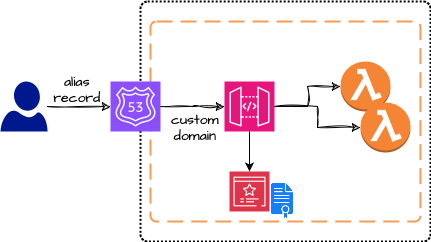

== Scaling Lambda

* Unreserved account concurrency up to 1K instances, this is for all lambdas in the same account, e.g.:, we've 10 lambdas in our account, but one of them hold-on 900, the other lambdas will need to share only the remains quota resources

* Reserved Concurrency means if I reserve 200 connections for one specific lambda will remain only 800 for all other lambdas

.Concurrency sample graph
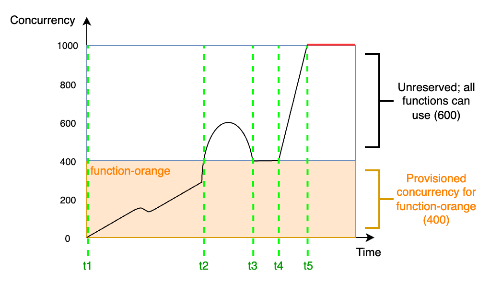

* On Rate of scaling in zero to one thousand, in most of the cases, can't be in one second even if your lambda has an aggressive cold start, to sum up, _provisioned concurrency_ means, _pre-initialized execution environments, no cold-start or throttling due to super-fast scaling and AWS will keep assigned capacity "Warmed"_, the question here is, make sense to keep provisioned concurrency to lambda? is probably better a EC2(Fargate or EKS), isn't it?

.Provisioned Concurrency Pricing
|===
|Provisioned Concurrency |Price

|Provisioned Concurrency
|$0.000004167 for every GB-second
|Duration

|Requests
|$0.20 per 1M requests
|$0.000009722 for every GB-second
|===

.Provisioned Concurrency configuration
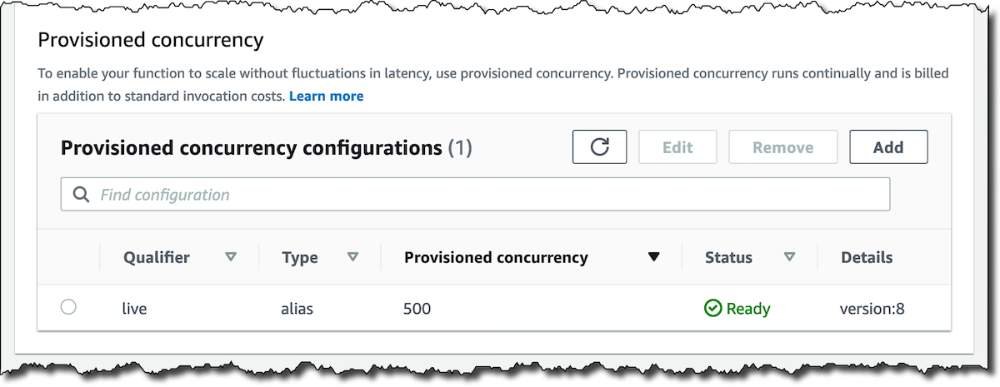

=== Lambda Layers

* Avoid duplicated buzz logic among lambdas

* Lets functions easily share code: upload layer once, reference within any function

* Layers can be anything as dependencies, training data, configuration files, etc

* Promote logic separation of responsibilities

* Get loaded with the function without additional execution latency

* To sum up, layers can simplify sharing and versioning common code deployed, 250 mb size limit (not recommended), and up to five layers per function

[%header,cols=2*]
|===
|To *DOs*
|Not To *DON'T's*

|Push shared code into discrete layers
|Don't push unnecessary stuff into the layer, don't treat it as dumpstar, it'll increase code loading time

|Version Layers and use to deploy across accounts
|

|Simplify your deployment management
|
|===

.Lambda Layers Concept
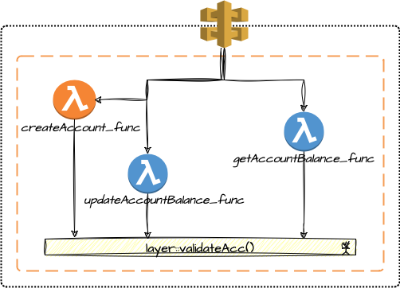

- https://docs.aws.amazon.com/lambda/latest/dg/chapter-layers.html[Working with Lambda Layers]

[source,java]
----
class MyLambda implements RequestHandler<MyRequestPojo, MyResponsePojo> {
   MyResponsePojo handleRequest(MyRequestPojo myRequestPojo, Context context) {
     if (validDigits(handleRequest.digits)) {
       createAccount(handleRequest);
     }
   }

   boolean validateAcc(AcctNo param) {}
   void createAccount(Context inputEvent) {}
}
----

.Lambda Async Destinations
image::thumb/pic/lambda-destinations1.png[]

.Lambda with API Gateway Throttling usage
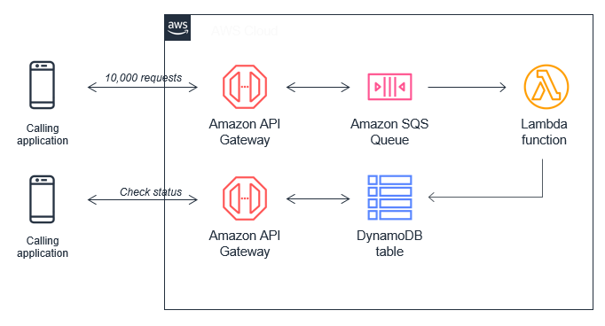

=== RDS Proxy

* In a scenario with gateway lambda and spike traffic using rds proxy, we can struggle with a limited number of rds connections, orphan connections linger or db memory/cpu spent, and really lambdas can quickly exhaust the connection limit, a possible workaround is use RDS Proxy, it situates between lambda and rds instance

* RDS Proxy is a fully managed, highly available database proxy; it allows applications to share a pool of database connections, using secret management for db credentials

.RDS Proxy Requirements
****
> IAM Prerequisites

. IAM Role for RDS Proxy
. IAM Role for Lambda

> VPC Rules

. Security Groups for lambda to Proxy to RDS
. Lambda requires external dependency
****

.RDS Proxy AWS
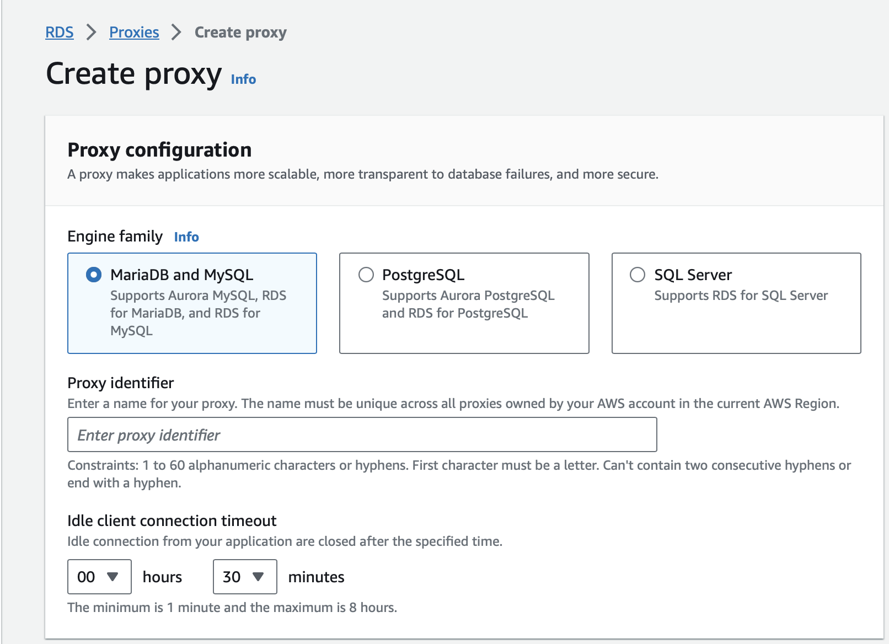

